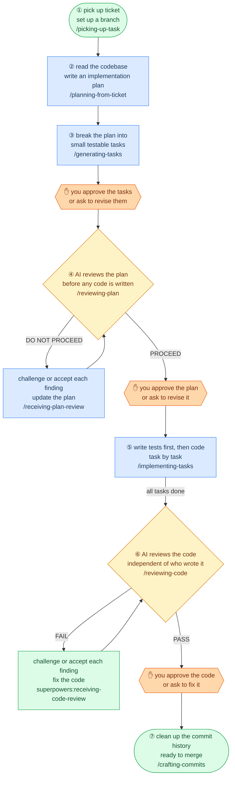

# README Update — Design Principles + Reader-Centric Restructure

> **For agentic workers:** REQUIRED SUB-SKILL: Use superpowers:subagent-driven-development (recommended) or superpowers:executing-plans to implement this plan task-by-task. Steps use checkbox (`- [ ]`) syntax for tracking.

**Goal:** Rewrite `README.md` so it works for both a new engineer evaluating the pipeline and an existing user referencing it — updated diagram with human gates, new Design Principles section, gate rows in Skills Reference, and a reader-first section order.

**Architecture:** Single-file edit to `README.md`. No skill logic changes. All changes are structural (reorder) or additive (new section, new diagram nodes, new table rows). The Mermaid diagram is replaced in-place; all other sections are either moved or augmented.

**Tech Stack:** Markdown, Mermaid flowchart syntax.

## Global Constraints

- Modify `README.md` only — no changes to any `SKILL.md` or other files.
- No new sections beyond those specified in the spec.
- No changes to installation commands, quickstart commands, or skills reference prose.
- Mermaid syntax must pass the markdownlint pre-commit hook.
- Keep all existing content — nothing is deleted, only moved or augmented.

---

### Task 1: Replace the Mermaid diagram

**Files:**
- Modify: `README.md` (the `## Agentic Coding Workflow` section, lines 9–37)

**Interfaces:**
- Consumes: nothing (first task)
- Produces: updated `## Agentic Coding Workflow` section with new Mermaid diagram; all downstream tasks depend on the final README structure

- [ ] **Step 1: Open README.md and locate the diagram block**

The diagram lives between `## Agentic Coding Workflow` and the closing ` ``` ` fence. It currently has three `classDef` entries (pipe, judge, sp) and no gate nodes.

- [ ] **Step 2: Replace the entire Mermaid code block**

Replace the existing Mermaid block (from the opening ` ```mermaid ` to the closing ` ``` `) with:

```markdown

```

- [ ] **Step 3: Verify markdownlint passes**

```bash
pre-commit run markdownlint --files README.md
```

Expected: `Passed`

- [ ] **Step 4: Commit**

```bash
git add README.md
git commit -m "docs(readme): replace diagram with plain-English labels and human gate nodes"
```

---

### Task 2: Add Design Principles section

**Files:**
- Modify: `README.md` (insert new section after `## Agentic Coding Workflow`, before `## Use cases`)

**Interfaces:**
- Consumes: Task 1 (README structure with updated diagram)
- Produces: new `## Design Principles` section in place

- [ ] **Step 1: Locate the insertion point**

Find the line `## Use cases` in README.md. The new section goes immediately before it.

- [ ] **Step 2: Insert the Design Principles section**

Insert the following block immediately before `## Use cases`:

```markdown
## Design Principles

**Review early, review often.** A flaw surfaced before coding costs nothing. The same flaw after five tasks can invalidate all five.

**Two review tiers, split by role.** Self-review handles mechanical checks — cheap, always runs, catches placeholders and format issues. AI-as-judge handles subjective quality calls — fresh context, targeted, catches design and scope problems. Neither replaces the other.

**Human gates are not optional.** Every AI verdict requires your approval before the next step starts. `REVIEW-LOG.md` is the audit trail.

**No self-preference bias.** Judge subagents run in a fresh context with no access to the producing session's framing or justifications.

**Auto mode removes pauses, not safeguards.** Git boundaries and judge halts are invariants in both modes. `auto` is a workflow speed setting, not a bypass.

**Enter at any step.** Every skill is independently usable. The pipeline is resumable, not monolithic — start wherever the upstream artifact already exists.

```

- [ ] **Step 3: Verify markdownlint passes**

```bash
pre-commit run markdownlint --files README.md
```

Expected: `Passed`

- [ ] **Step 4: Commit**

```bash
git add README.md
git commit -m "docs(readme): add Design Principles section"
```

---

### Task 3: Reorder sections for reader-first flow

**Files:**
- Modify: `README.md` (move `## Use cases` to sit before `## Installation`)

**Interfaces:**
- Consumes: Task 2 (README with Design Principles section)
- Produces: README with section order: diagram → principles → use cases → installation → quickstart → skills reference → collaborative mode → composes with superpowers → book skills

**Context:** Currently `## Use cases` sits after the diagram but before `## Installation` — this is already the correct position. Verify the order matches the spec before making any moves. If it already matches, skip the reorder and commit a no-op note.

- [ ] **Step 1: Check current section order**

Scan README.md headings:

```bash
grep "^## " README.md
```

Expected current order:
```
## Agentic Coding Workflow
## Use cases
## Installation
## Quickstart
## Skills Reference
## Collaborative vs auto mode
## Composes with superpowers
## Book Skills
```

- [ ] **Step 2: Move "Composes with superpowers" block if needed**

The spec requires `## Composes with superpowers` to sit immediately after `## Collaborative vs auto mode` and before `## Book Skills`. If `grep` above shows it already in that position, skip this step.

If it is not in that position: cut the entire `## Composes with superpowers` block (from its `##` heading to the line before `## Book Skills`) and paste it immediately after the `## Collaborative vs auto mode` section.

- [ ] **Step 3: Verify final section order**

```bash
grep "^## " README.md
```

Expected:
```
## Agentic Coding Workflow
## Use cases
## Installation
## Quickstart
## Skills Reference
## Collaborative vs auto mode
## Composes with superpowers
## Book Skills
```

- [ ] **Step 4: Verify markdownlint passes**

```bash
pre-commit run markdownlint --files README.md
```

Expected: `Passed`

- [ ] **Step 5: Commit**

```bash
git add README.md
git commit -m "docs(readme): consolidate Composes with superpowers block after Collaborative vs auto mode"
```

---

### Task 4: Add Gates rows to Skills Reference tables

**Files:**
- Modify: `README.md` (the `## Skills Reference` section — four skill tables)

**Interfaces:**
- Consumes: Task 3 (README with correct section order)
- Produces: each relevant skill table has `**Checks**` and `**Writes**` rows documenting REVIEW-LOG gate behaviour

The four skills to update and their gate values:

| Skill | Checks on entry | Writes on exit |
|---|---|---|
| `generating-tasks` | — | `generating-tasks` stamp in `REVIEW-LOG.md` after human approval |
| `reviewing-plan` | `generating-tasks` stamp in `REVIEW-LOG.md` | `reviewing-plan` stamp in `REVIEW-LOG.md` after human approval |
| `implementing-tasks` | `reviewing-plan` stamp in `REVIEW-LOG.md` | — (AI self-reviews between tasks, no human gate) |
| `reviewing-code` | — | `reviewing-code` stamp in `REVIEW-LOG.md` after human approval |
| `crafting-commits` | `reviewing-code` stamp in `REVIEW-LOG.md` | — (terminal step) |

- [ ] **Step 1: Add Gates row to `generating-tasks` table**

Locate the `generating-tasks` reference table. It looks like:

```markdown
| | |
|---|---|
| **Input** | Plan file ...
| **Output** | `# Tasks` section ...
| **Auto mode** | Supported ...
```

Add after the last row:

```markdown
| **Writes** | `generating-tasks` stamp in `REVIEW-LOG.md` after you approve |
```

- [ ] **Step 2: Add Gates rows to `reviewing-plan` table**

Locate the `reviewing-plan` reference table. Add after the last existing row:

```markdown
| **Checks** | `generating-tasks` stamp in `REVIEW-LOG.md` |
| **Writes** | `reviewing-plan` stamp in `REVIEW-LOG.md` after you approve |
```

- [ ] **Step 3: Add Gates row to `implementing-tasks` table**

Locate the `implementing-tasks` reference table. Add after the last existing row:

```markdown
| **Checks** | `reviewing-plan` stamp in `REVIEW-LOG.md` |
```

- [ ] **Step 4: Add Gates rows to `reviewing-code` table**

Locate the `reviewing-code` reference table. Add after the last existing row:

```markdown
| **Writes** | `reviewing-code` stamp in `REVIEW-LOG.md` after you approve |
```

- [ ] **Step 5: Add Gates row to `crafting-commits` table**

Locate the `crafting-commits` reference table. Add after the last existing row:

```markdown
| **Checks** | `reviewing-code` stamp in `REVIEW-LOG.md` |
```

- [ ] **Step 6: Verify markdownlint passes**

```bash
pre-commit run markdownlint --files README.md
```

Expected: `Passed`

- [ ] **Step 7: Commit**

```bash
git add README.md
git commit -m "docs(readme): add REVIEW-LOG gate rows to Skills Reference tables"
```

---

### Task 5: Final review pass

**Files:**
- Read: `README.md`

**Interfaces:**
- Consumes: Tasks 1–4 (completed README)
- Produces: confirmed correct README or fixes applied

- [ ] **Step 1: Verify section order**

```bash
grep "^## " README.md
```

Expected:
```
## Agentic Coding Workflow
## Use cases
## Installation
## Quickstart
## Skills Reference
## Collaborative vs auto mode
## Composes with superpowers
## Book Skills
```

- [ ] **Step 2: Verify diagram has all four classDef entries and gate nodes**

```bash
grep -E "classDef|HG[0-9]|gate" README.md
```

Expected: four `classDef` lines (pipe, judge, sp, gate), three `HG` node definitions, three `HG` lines in the edge list.

- [ ] **Step 3: Verify Design Principles section exists with six principles**

```bash
grep "^## Design Principles" README.md
```

Expected: one match.

- [ ] **Step 4: Verify gate rows exist in all five skill tables**

```bash
grep "Checks\|Writes" README.md
```

Expected: at least 7 matches (one Writes for generating-tasks, two for reviewing-plan, one Checks for implementing-tasks, one Writes for reviewing-code, one Checks for crafting-commits).

- [ ] **Step 5: Run full pre-commit**

```bash
pre-commit run --files README.md
```

Expected: all hooks pass.

- [ ] **Step 6: Commit if any fixes were needed**

```bash
git add README.md
git commit -m "docs(readme): final corrections from review pass"
```

Only commit if Step 5 required changes. Skip if everything already passed.
